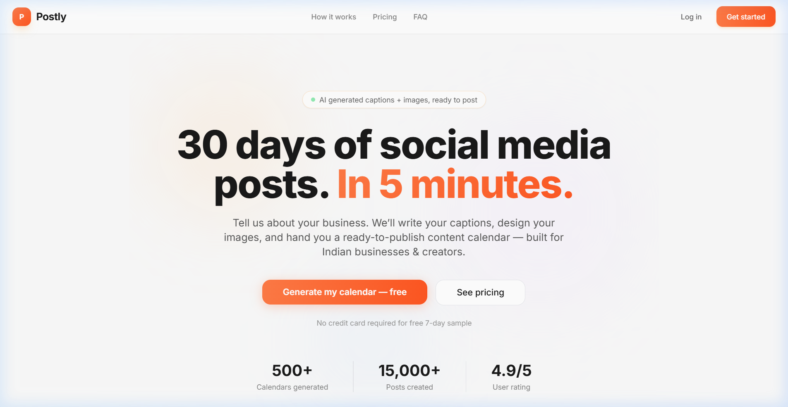

# Social Media Agent 🚀

An institutional-grade AI social media automation ecosystem. Generate 30 days of high-quality, ready-to-post content in minutes using state-of-the-art LLMs (Gemini & Claude).



## 🌟 Key Features

- **Multi-Agent Architecture**: Uses both Gemini (Postly) and Claude (Social Media App) for diverse content generation.
- **Dynamic Content Calendar**: AI-powered generation of captions, visual ideas, and scheduling recommendations.
- **Brand Intelligence**: Personalized content tailored to specific brand voices and target audiences.
- **Institutional-Grade UI**: Modern, responsive dashboard built with React, Vite, and Tailwind CSS.
- **Automated Delivery**: Integrated email delivery and Supabase persistence.

## 🏗️ Project Structure

The project is divided into two main applications:

### 1. Postly (Vite + React + Express)
- **Frontend**: `postly/` - Modern React dashboard for managing content calendars.
- **Backend**: `postly/server/` - Express.js API integrating Google Gemini AI.

### 2. Social Media App (Next.js)
- **App**: `social-media-app/` - Next.js application with built-in agentic workflows using Anthropic Claude.

## 🛠️ Tech Stack

- **Frontend**: React 19, Next.js 16, Vite 8, Tailwind CSS, Radix UI.
- **Backend**: Node.js, Express.js.
- **AI**: Google Gemini AI, Anthropic Claude.
- **Database/Auth**: Supabase.
- **Automation**: Make.com (integrations).

## 🚀 Quick Start

### Prerequisites
- Node.js (v18+)
- API Keys: Google AI (Gemini), Anthropic (Claude), Supabase.

### 1. Setup Backend (Postly)
```bash
cd postly/server
npm install
# Create .env and add GEMINI_API_KEY, SUPABASE_URL, SUPABASE_ANON_KEY
npm start
```

### 2. Setup Frontend (Postly)
```bash
cd postly
npm install
# Create .env.local and add VITE_SUPABASE_URL, VITE_SUPABASE_ANON_KEY
npm run dev
```

### 3. Setup Next.js App
```bash
cd social-media-app
npm install
# Create .env.local and add ANTHROPIC_API_KEY, NEXT_PUBLIC_SUPABASE_URL, etc.
npm run dev
```

## 📸 Screenshots

See [SCREENSHOTS.md](SCREENSHOTS.md) for a full gallery of the application pages.

## 📄 License

This project is licensed under the MIT License - see the [LICENSE](LICENSE) file for details.
